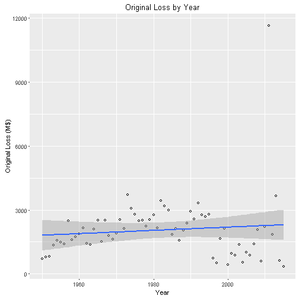
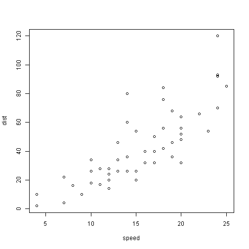
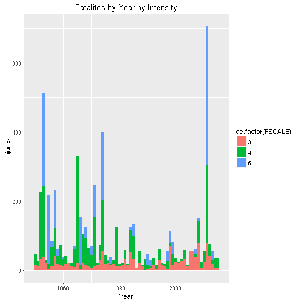

The Shiny App for Tornado Loss
========================================================
author: Jianjun Luo
date: 19th May 2016

The Analysis of Tornado Loss in USA

Introduction
========================================================

This is a Shiny application for estimation of tornado loss in USA by analyzing tornado data between 1950-2015 from both visualization and model perspective.  

The app includes three parts:

- Economic Loss Data and Model
- Fatalities and Injuries
- About (Background of the study)

Economic Loss Data and Model
========================================================
**Questions**
- Are there more and more losses from tornado increasing year by year?  
- Do we have more losses now than past?    

With the regression model, we can see it seems there is a increase in the economic loss since 1950. It seems reasonable since there are more people and money now than past.  

***

 
However, is that true?

Please select the checkbox "trend Loss to 2015 value" on the left side of the Shiny App to see a different model (and I will show the result in next slide here).

Economic Loss and Intensity
========================================================
As we can see, if you take the inflation into consideration, the model will be totally different. Now the losses are decreasing since 1950.  
It can also be reasonable.   
Why? Think more or just google it.   

***
This App also shows how the economic loss changes with the intensity (by checkbox) accross different time periods, which could be adjusted (by slider).   

Fatalites and Injuries
========================================================
 
**Question:** What kind of tornado mainly contributes to those losses?  

Please check the fatalities and injuries from the tornado by selecting the [**tabPanel** "Fatalities and Injuries"](https://jluo.shinyapps.io/ShinyApplication/#tab-8887-1) on the top part of App's page.

Also, you can get some background information about tornado in USA by selecting the [**tabPanel** "About"](https://jluo.shinyapps.io/ShinyApplication/#tab-5185-3) on the top part of App's page.  

Finally, the application can be found at [https://jluo.shinyapps.io/ShinyApplication/](https://jluo.shinyapps.io/ShinyApplication/)  
Code at [https://github.com/jluoAIR/ShinyApplication](https://github.com/jluoAIR/ShinyApplication)
